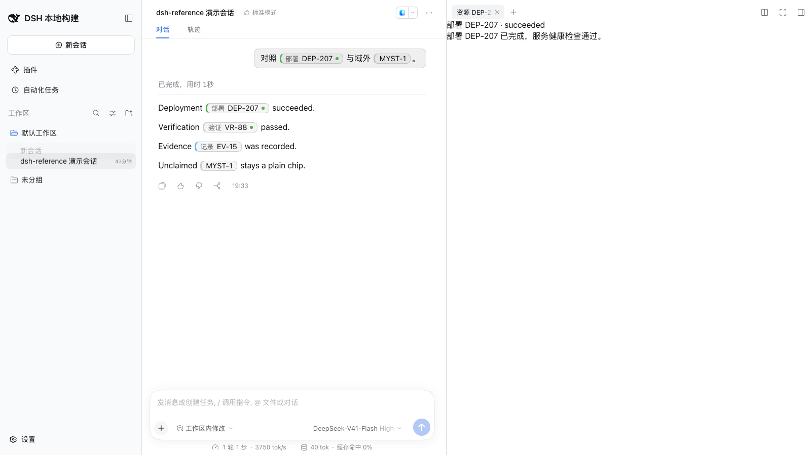
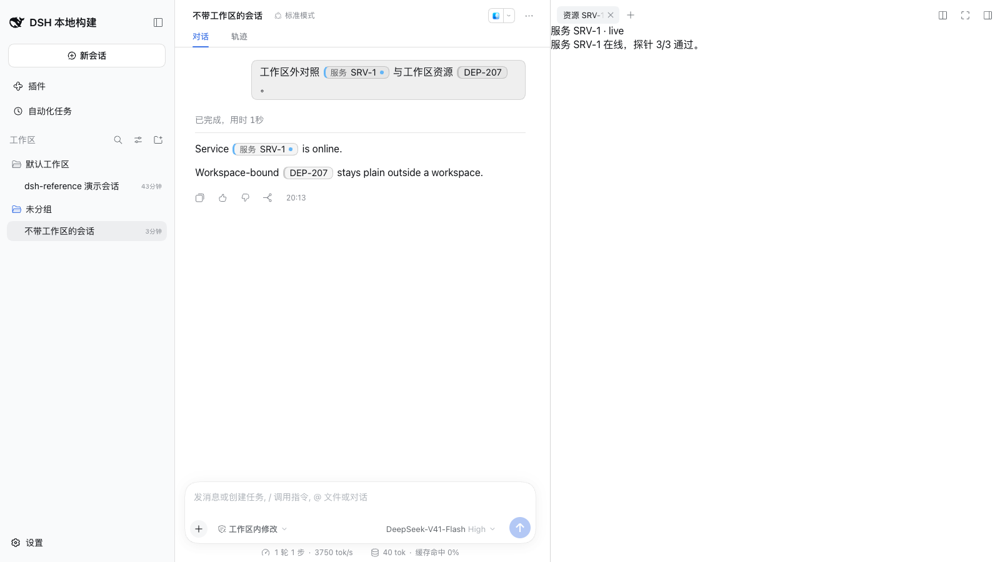

[中文](./README.zh-CN.md) · English

# dsh-reference-render

Domain-neutral **structured reference rendering & interaction primitives** for [DeepSeek Harness (DSH)](https://github.com/deepseek-ai/deepseek-harness) conversations and panels.

> Zero core edits. The plugin mounts as a bundle and leaves no core patch when removed. Opening a reference uses the host right sidebar: a content plugin calls `sidebarRight.openResource` and registers a native tab. This package does not draw its own column.

Turn structured text references into prominent inline chips, with hover previews, activation routing, and a contribution contract that lets **other plugins** supply domain content — while this package understands **no business domain at all**.

```text
Build completed. See [RP-42](dsh-ref:report:RP-42) for details.
                 └ rendered as an inline chip: hover → preview, click → open
```

## Features

- **Inline chips.** `[label](dsh-ref:<kind>:<id>)` renders as a chip in a DSH conversation and stays an ordinary link in plain markdown.
- **Hover preview.** Other plugins contribute the body through `reference.hover.content`. With no claimant, no empty panel appears.
- **Open.** A click dispatches `reference/open`. When the session belongs to a workspace, the payload includes `workspace: { id, title?, path? }`. When the session belongs to none, that field is absent.
- **Content follows the workspace field.** In the examples, deployment, verification, and evidence claim only a session that has a workspace. Service SRV-1 claims only a session that has none. A reference that does not match stays a plain chip, and a click does nothing.
- **Host right sidebar.** A claimant calls `sidebarRight.openResource` and registers a native tab.



A session inside a workspace. The event includes `workspace`. DEP-207 shows a status dot. MYST-1 has no claimant.



A session outside every workspace. The event omits `workspace`. SRV-1 is claimed. Workspace-bound DEP-207 stays a plain chip.

## Why

DSH conversations carry structured references (issues, reports, deployments, knowledge…). Plain markdown links degrade to inert text. `dsh-reference-render` provides the missing primitive layer:

- **wire syntax** — `[label](dsh-ref:<kind>:<id>)`, a GFM-link-compatible form that degrades safely in any renderer and is streaming-safe by construction;
- **ReferenceDescriptor** — a domain-neutral identity (`uri` + open-vocabulary `kind`), never carrying canonical business state;
- **inline chips** — accessible, styled, single visual implementation;
- **hover previews** — debounce/grace lifecycle with AbortSignal stale-suppression, content contributed via a chain slot;
- **activation** — `reference/open` typed cordis serial event (first-bail-wins) routing to whoever claims the reference;
- **authoring guidance** — a systemPrompt section teaching agents the syntax and its discipline (never invent IDs).

## Install

Requires a working `dsh web`, Node.js `^22.19` or `>=24`, and pnpm 10+. Replace `web` with your profile name.

This package is tested only on **DSH 0.2.1-alpha.1**. `engines.dsh` is that exact version. `@latest` and a caret range will track later releases that this package has not been tested with. The current host does not reject an install from `engines.dsh`; a wrong range is not caught at boot.

| Your DSH | Install |
|---|---|
| **0.2.1-alpha.1** | `dsh plugin --profile web add dsh-reference-render@0.1.0` |
| anything else | No supported release. Move DSH to 0.2.1-alpha.1 first |

Use the row above after the package is on a registry. The path exercised locally is a tarball:

```bash
dsh --profile web --from-default-profile web
dsh plugin --profile web add <path-to-dsh-reference-render-0.1.0.tgz>
```

Create the profile from the web template first. `dsh plugin add` on a name that does not exist yet creates a profile with no app bundle, and boot then shows nothing.

`dsh plugin add` appends this package to the profile bundle list and applies the package `cordis.patch.yml`. Leave the profile's own `cordis.patch.yml` unchanged. A second insert of `id: dsh-reference-render` is refused at boot as a duplicate loader entry id.

Confirm the layer before restarting:

```bash
dsh --profile web --dump-config | grep -A1 'id: dsh-reference-render'
```

Restart DSH Web after install. The host half registers a systemPrompt section, so a restart is required. A later client-only change is picked up by a hard refresh (Cmd/Ctrl+Shift+R).

### Update

```bash
dsh plugin --profile web add dsh-reference-render@0.1.0
```

Pin the version. Restart afterwards. A client-only change needs only a hard refresh.

### Uninstall

```bash
dsh plugin --profile web remove dsh-reference-render
```

That removes the dependency and the bundle layer and leaves no core patch. Leave the profile `cordis.patch.yml` unchanged, then restart.

### Install from source

```text
1. git clone <this repo> && cd dsh-reference-render && pnpm install && pnpm build
2. dsh --profile web --from-default-profile web
3. dsh plugin --profile web add <clone directory>
4. dsh --profile web --dump-config | grep -A1 'id: dsh-reference-render'
5. Restart DSH Web
```

A git install fetches source. `prepare` builds `lib/` after that fetch. pnpm skips a git dependency's `prepare` until the profile's `pnpm-workspace.yaml` lists it under `allowBuilds`. That entry is permission for the package to run code on the machine at install time.

A registry install and a tarball (`npm pack`) already contain `lib/`. They do not need that permission.

### Troubleshooting

| What you see | What to do |
|---|---|
| No profile, or boot shows an empty UI | Run `dsh --profile web --from-default-profile web`, then `dsh plugin add` |
| Boot reports a duplicate loader entry id | The profile `cordis.patch.yml` still has a handwritten `id: dsh-reference-render` row. Remove that row. Keep the layer `dsh plugin add` wrote into the bundle list |
| `ERR_PNPM_ADDING_TO_ROOT` | This web template marks the profile as a pnpm workspace root. Add `ignore-workspace-root-check=true` to that profile's `.npmrc` and run the same `dsh plugin add`. Logs are under the profile's `.plugin-manager/logs` |
| Git install has no `lib/` | Allow this package under `allowBuilds` in the profile `pnpm-workspace.yaml`, then install again |
| Chips do not appear in the conversation | This package ships the chip, hover, and open primitives. Conversation wiring is `examples/conversation-demo`. The resource page is `examples/sidebar-demo`. See [examples/conversation-demo/README.md](./examples/conversation-demo/README.md) |

See [COMPATIBILITY.md](./COMPATIBILITY.md) for the tested DSH/Node matrix.

## Usage

### Render wire references (any React surface)

```tsx
import { WireText } from 'dsh-reference-render/runtime'

<WireText
  text={'Build completed. See [RP-42](dsh-ref:report:RP-42).'}
  renderText={(text) => <MarkdownText text={text} streaming={streaming} labels={labels} />}
/>
```

### Contribute hover content / claim activation (your plugin)

```ts
// hover preview — chain slot, first-match wins
ctx.effect(() => ctx.slots.inject('reference.hover.content', () =>
  ctx.slots.register({
    name: 'reference.hover.content',
    select: (owner) => owner.descriptor.kind === 'deployment' ? {} : null,
  }, DeploymentHoverCard)))

// activation — typed serial event, first-taker wins
ctx.on('reference/open', ({ descriptor }) =>
  descriptor.kind === 'deployment' ? (openDeployment(descriptor), referenceHandled()) : undefined)
```

### Conversation integration

The official `conversation.chat.node` keyed slot has **no public link-component seam** in DSH 0.2.1-alpha.1; this package therefore ships the building blocks rather than a takeover: `decorateChatNode` (community-standard in-place decorator with clean restore) + `WireText` segment renderer. Hosts that own a chat node body compose them; see [contracts/render-hook.md](./contracts/render-hook.md).

## Contracts (frozen v0.1)

| Contract | Doc |
|---|---|
| Reference syntax | [contracts/reference-syntax.md](./contracts/reference-syntax.md) |
| ReferenceDescriptor | [contracts/reference-descriptor.md](./contracts/reference-descriptor.md) / [schema](./contracts/reference-descriptor.schema.json) |
| Render hook | [contracts/render-hook.md](./contracts/render-hook.md) |
| Interaction events | [contracts/reference-interaction-events.md](./contracts/reference-interaction-events.md) |
| Contribution | [contracts/reference-contribution.md](./contracts/reference-contribution.md) |
| Compatibility | [COMPATIBILITY.md](./COMPATIBILITY.md) |

## Examples (executable, run in CI)

- [examples/minimal](./examples/minimal) — text → parse → chip → hover, zero business domain.
- [examples/contribution](./examples/contribution) — three fake domains (deployment/verification/evidence) contributing hover content and claiming activation around one domain-neutral protocol.

## Verify

```bash
pnpm verify   # typecheck → tests (incl. stream-split regression + security gate) → build → pack audit → sanitize scan
```

## Boundary

This renderer owns **no business truth**. It does not resolve domains, cache status, or duplicate canonical state — `View ≠ Truth`. Domains are contributed by plugins through the frozen contracts above.

## License

[MIT](./LICENSE)
