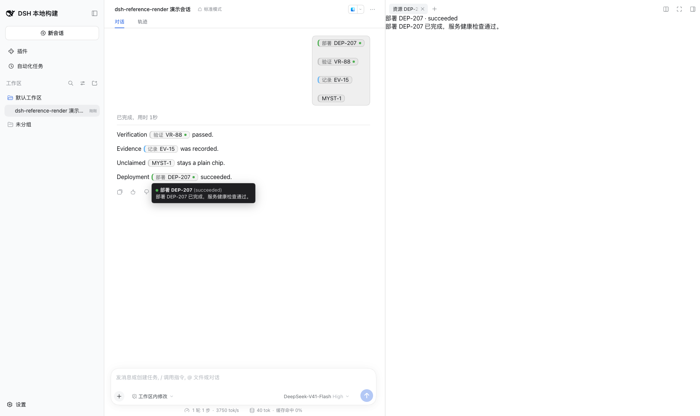
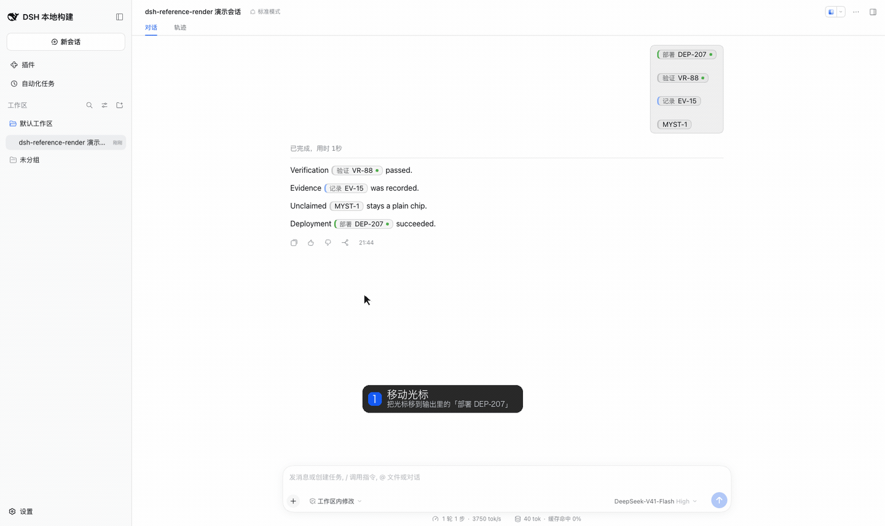

中文 · [English](./README.md)

# dsh-reference-render

[](https://opensource.org/licenses/MIT)
[](https://github.com/deepseek-ai/deepseek-harness)
[](https://github.com/topics/dsh-reference-render)


面向 [DeepSeek Harness（DSH）](https://github.com/deepseek-ai/deepseek-harness)对话与面板的**域中立结构化引用渲染与交互原语**。

> 不改宿主，纯插件挂载，卸载后宿主保持原样。引用打开走 DSH 官方右侧栏：内容方调用 `sidebarRight.openResource`，并注册原生 tab。本包不自绘右列。

把结构化文本中的引用变成显著的内联 chip，支持悬浮预览、激活路由，以及让**其他插件**供给领域内容的贡献契约——而本包自身**不理解任何业务领域**。

```text
Build completed. See [RP-42](dsh-ref:report:RP-42) for details.
                 └ 渲染为内联 chip：悬浮 → 预览，点击 → 打开
```

## 功能

- **行内 chip**。`[标签](dsh-ref:<kind>:<id>)` 在对话里渲染成可点的引用，普通 markdown 里仍是链接。
- **悬浮预览**。内容由其他插件经 `reference.hover.content` 贡献。没有认领方时不出现空面板。
- **打开**。点击派发 `reference/open`。会话属于某个工作区时，载荷带 `workspace: { id, title?, path? }`；会话不在任何工作区时，这个字段不出现。
- **内容按工作区分流**。示例里部署、验证、记录只在带工作区的会话里认领；服务 SRV-1 只在不带工作区的会话里认领。对不上的引用留成素 chip，点击没有副作用。
- **官方右侧栏**。认领成功后内容方调用 `sidebarRight.openResource`，注册的是原生 tab。





这两张图要同时装上仓库里的两个示例组合包才出现。`examples/conversation-demo` 把输入和输出里的引用渲染成 chip，并托管悬浮面板。`examples/sidebar-demo` 认领内容，点击后用 `sidebarRight.openResource` 在官方右侧栏打开资源。只装本包时，对话里还没有 chip。步骤见 [examples/conversation-demo/README.md](./examples/conversation-demo/README.md)。

## 为什么

DSH 对话承载结构化引用（事务、报告、部署、知识……）。普通 markdown link 会降级为惰性文本。`dsh-reference-render` 提供缺失的原语层：

- **wire 语法**——`[label](dsh-ref:<kind>:<id>)`，与 GFM link 兼容，在任何渲染器中安全降级，结构上天然流式安全；
- **ReferenceDescriptor**——域中立身份（`uri` + 开放词表 `kind`），绝不携带 canonical 业务状态；
- **内联 chip**——可访问、有样式、单一视觉实现；
- **悬浮预览**——debounce/宽限生命周期 + AbortSignal 陈旧抑制，内容由 chain slot 贡献；
- **激活**——`reference/open` typed cordis serial 事件（first-bail-wins），路由到认领该引用的一方；
- **authoring guidance**——systemPrompt 段，教学语法与纪律（严禁编造 ID）。

## 安装

前置：`dsh web` 能正常打开，Node.js `^22.19` 或 `>=24`，pnpm 10+。命令里的 `web` 换成你自己的 profile 名即可。

本包只在 **DSH 0.2.1-alpha.1** 上测过。`engines.dsh` 写成这个精确版本。写 `@latest` 或 caret 范围会在以后的版本线上装到未测过的包。安装期的兼容性拦截看 `peerDependencies` 里的 `@deepseek-ai/dsh*` 条目——这里是 `@deepseek-ai/dsh-client-ui-slots`——版本不符会在 `dsh plugin add` 阶段被拦下并给出精确版本提示；`engines.dsh` 只是声明。

| 你的 DSH | 安装 |
|---|---|
| **0.2.1-alpha.1** | `dsh plugin --profile web add dsh-reference-render@0.1.0` |
| 其他版本 | 没有可装版本。先把 DSH 换到 0.2.1-alpha.1 |

源码树构建出的产物按 tarball 安装：

```bash
dsh --profile web --from-default-profile web
dsh plugin --profile web add <path-to-dsh-reference-render-0.1.0.tgz>
```

profile 必须先用 web 模板建出来。对还不存在的名字直接 `dsh plugin add`，会建成没有应用组合包的档，启动后没有任何界面。

`dsh plugin add` 把本包追加进 profile 的组合包列表，并应用包内的 `cordis.patch.yml`。profile 自己的 `cordis.patch.yml` 保持原样。同一个 `id: dsh-reference-render` 再插入一次，加载器会以 duplicate loader entry id 拒绝启动。

重启前确认这一层已经组合进去：

```bash
dsh --profile web --dump-config | grep -A1 'id: dsh-reference-render'
```

装完重启 DSH Web。host 半提供 systemPrompt 段，要重启才生效。之后只改 client 半时，硬刷新浏览器（Cmd/Ctrl+Shift+R）即可。

### 更新

```bash
dsh plugin --profile web add dsh-reference-render@0.1.0
```

版本号写死。改完重启；若这次只动了 client 产物，硬刷新即可。

### 卸载

```bash
dsh plugin --profile web remove dsh-reference-render
```

依赖和组合包层一起去掉，核心不留补丁。profile 的 `cordis.patch.yml` 保持原样，然后重启。

### 从源码安装

```text
1. git clone <本仓库> && cd dsh-reference-render && pnpm install && pnpm build
2. dsh --profile web --from-default-profile web
3. dsh plugin --profile web add <克隆目录>
4. dsh --profile web --dump-config | grep -A1 'id: dsh-reference-render'
5. 重启 DSH Web
```

git 安装拿到的是源码。本包的 `prepare` 会在安装之后构建 `lib/`。pnpm 在 profile 的 `pnpm-workspace.yaml` 用 `allowBuilds` 放行之前，不会运行 git 依赖的 `prepare`。这条授权表示安装时在本机执行该包的代码。

注册表安装和 tarball（`npm pack`）里已经带有 `lib/`，不需要这项授权。

### 常见问题

| 现象 | 处理 |
|---|---|
| 找不到 profile，或启动后没有界面 | 先跑 `dsh --profile web --from-default-profile web`，再 `dsh plugin add` |
| 启动报 duplicate loader entry id | profile 的 `cordis.patch.yml` 里还有手写的 `id: dsh-reference-render`。删掉那段，只保留 `dsh plugin add` 写进组合包列表的那一层 |
| `ERR_PNPM_ADDING_TO_ROOT` | 这个版本的 web 模板把 profile 标成 pnpm workspace 根。在该 profile 的 `.npmrc` 写入 `ignore-workspace-root-check=true`，再跑同一条 `dsh plugin add`。日志在 profile 的 `.plugin-manager/logs` |
| git 安装后没有 `lib/` | 在 profile 的 `pnpm-workspace.yaml` 里为 `allowBuilds` 放行本包，然后重新安装 |
| 装完对话里没有 chip | 本包只提供 chip、悬浮和打开原语。对话里的接线在 `examples/conversation-demo`，右侧资源页在 `examples/sidebar-demo`。见 [examples/conversation-demo/README.md](./examples/conversation-demo/README.md) |

已测 DSH/Node 矩阵见 [COMPATIBILITY.md](./COMPATIBILITY.md)。

## 用法

### 渲染 wire 引用（任意 React 面）

```tsx
import { WireText } from 'dsh-reference-render/runtime'

<WireText
  text={'Build completed. See [RP-42](dsh-ref:report:RP-42).'}
  renderText={(text) => <MarkdownText text={text} streaming={streaming} labels={labels} />}
/>
```

### 贡献悬浮内容 / 认领激活（你的插件）

```ts
// 悬浮预览——chain slot，first-match 胜出
ctx.effect(() => ctx.slots.inject('reference.hover.content', () =>
  ctx.slots.register({
    name: 'reference.hover.content',
    select: (owner) => owner.descriptor.kind === 'deployment' ? {} : null,
  }, DeploymentHoverCard)))

// 激活——typed serial 事件，首个接管者胜出
ctx.on('reference/open', ({ descriptor }) =>
  descriptor.kind === 'deployment' ? (openDeployment(descriptor), referenceHandled()) : undefined)
```

### 对话集成

官方 `conversation.chat.node` keyed slot 在 DSH 0.2.1-alpha.1 **没有公开的 link 组件 seam**；因此本包交付构建块而非接管：`decorateChatNode`（社区标准的原地装饰器 + 干净回滚）+ `WireText` 分段渲染器。拥有 chat node body 的宿主自行组装；见 [contracts/render-hook.md](./contracts/render-hook.md)。

## 契约（v0.1 冻结）

| 契约 | 文档 |
|---|---|
| 引用语法 | [contracts/reference-syntax.md](./contracts/reference-syntax.md) |
| ReferenceDescriptor | [contracts/reference-descriptor.md](./contracts/reference-descriptor.md) / [schema](./contracts/reference-descriptor.schema.json) |
| 渲染钩子 | [contracts/render-hook.md](./contracts/render-hook.md) |
| 交互事件 | [contracts/reference-interaction-events.md](./contracts/reference-interaction-events.md) |
| 贡献契约 | [contracts/reference-contribution.md](./contracts/reference-contribution.md) |
| 兼容性 | [COMPATIBILITY.md](./COMPATIBILITY.md) |

## 示例（可执行，CI 中真实运行）

- [examples/minimal](./examples/minimal)——text → parse → chip → hover，零业务域。
- [examples/contribution](./examples/contribution)——三个 fake 域（deployment/verification/evidence）围绕同一个域中立协议贡献悬浮内容与认领激活。

## 验证

```bash
pnpm verify   # typecheck → tests（含流式全边界回归 + 安全门）→ build → pack 审计 → 脱敏扫描
```

## 边界

本渲染器**不拥有任何业务真相**。不 resolve 领域、不缓存状态、不复制 canonical 状态——`View ≠ Truth`。领域由插件经上述冻结契约贡献。

## License

[MIT](./LICENSE)
